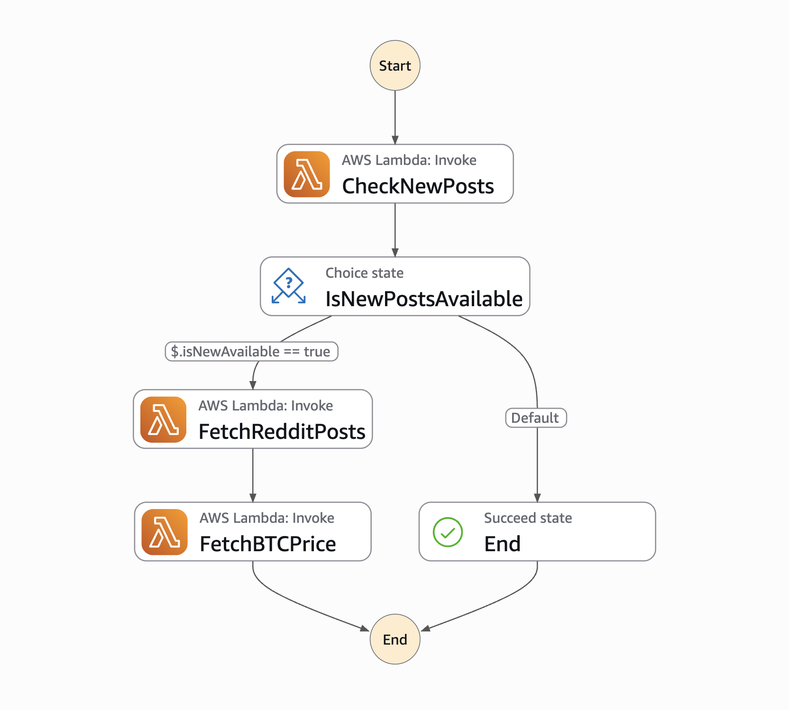
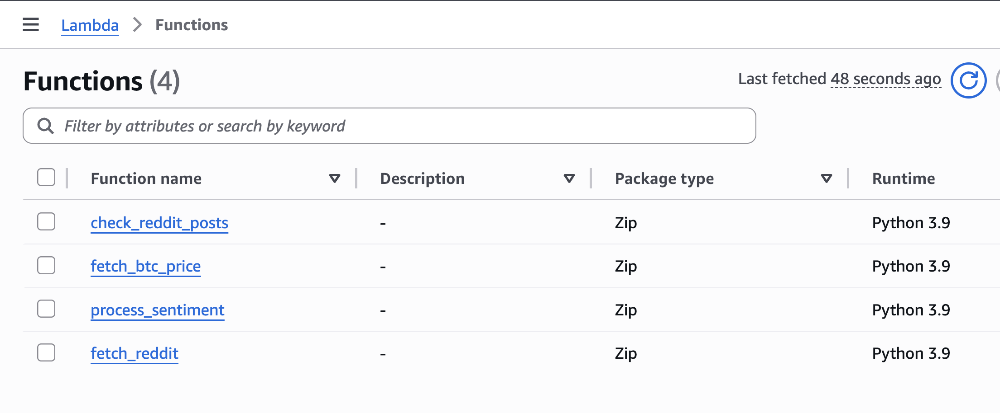

# Bitcoin Price Prediction using Sentiment Analysis

> **End-to-End ML System** that predicts Bitcoin prices by combining **Reddit sentiment analysis** with **time series modeling**.  
> Designed and implemented to showcase **data pipelines, NLP, time series forecasting, ML models, and deployment practices** at a **MAANG-level standard**.

---

## Problem Statement

Bitcoin prices are highly volatile and influenced not only by technical and market factors, but also by **public sentiment**.  
The goal of this project is to build a **real-time, automated pipeline** that:

1. Collects **Bitcoin-related Reddit discussions & daily BTC prices**.  
2. Extracts and quantifies **sentiment scores** using NLP.  
3. Builds **time series + ML models** (VAR, Prophet, XGBoost) to forecast future prices.  
4. Continuously updates as new data arrives using **Airflow** and (optionally) **AWS cloud services**.  

---

## Project Architecture

        Reddit API         CoinGecko API
             │                   │
             ▼                   ▼
    ┌───────────────────────────────────┐
    │    Airflow ETL Pipeline (Docker)  │
    │  - Collect daily posts & prices   │
    │  - Sentiment scoring (VADER)      │
    │  - Store in PostgreSQL / S3       │
    └───────────────────────────────────┘
                      │
                      ▼
    ┌───────────────────────────────────┐
    │     Data Processing & Features    │
    │  - Aggregate daily avg sentiment  │
    │  - Create returns & lag features  │
    └───────────────────────────────────┘
                      │
                      ▼
    ┌───────────────────────────────────┐
    │   Modeling & Forecasting Layer    │
    │  - VAR (Granger causality test)   │
    │  - Prophet (trend + seasonality)  │
    │  - XGBoost (ML regression)        │
    └───────────────────────────────────┘
                      │
                      ▼
    ┌───────────────────────────────────┐
    │  Evaluation & Visualization       │
    │  - Rolling forecasts              │
    │  - MAE / RMSE metrics             │
    │  - Interactive dashboard (future) │
    └───────────────────────────────────┘

---

## Methodology

### 1. **Data Collection**
- Reddit posts scraped using **PRAW API**.
- Bitcoin prices from **CoinGecko API**.
- Orchestrated daily with **Apache Airflow** (Docker Compose).

### 2. **Sentiment Analysis**
- Preprocessing: cleaning, tokenization.  
- Models:
  - **VADER** (baseline for finance text).   
- Aggregate into **daily average sentiment scores**.

### 3. **Feature Engineering**
- `price_returns` = log returns of daily BTC prices.  
- `sentiment_lagN` = sentiment lags for up to 7 days.  
- Stationarity tested with **ADF** and **KPSS**.

### 4. **Modeling**
- **Granger Causality**: Test directional influence between sentiment ↔ returns.  
- **VAR (Vector AutoRegression)**:
  - Jointly model price returns and sentiment.  
  - Capture bidirectional dependencies.  
- **Prophet**:
  - Captures long-term trend + seasonality.  
  - Forecasts future Bitcoin prices directly.  
- **XGBoost**:
  - Gradient boosting model with lagged features.  
  - Captures nonlinear effects.

### 5. **Evaluation**
- Rolling forecast validation.  
- Metrics:  
  - **MAE (Mean Absolute Error)**  
  - **RMSE (Root Mean Squared Error)**  
- Forecasts compared against actual daily prices from pipeline.

---

## Tech Stack

- **Data Collection**: PRAW, CoinGecko API  
- **Pipeline Orchestration**: Apache Airflow (Docker)  
- **Data Storage**: AWS S3 (cloud) and CSV (local)
- **NLP & Sentiment Analysis**: Tokenize, VADER 
- **Modeling**: Statsmodels (VAR), Prophet, XGBoost, Scikit-learn  
- **Visualization**: Matplotlib, Plotly (future dashboard with Streamlit/Dash)  
- **Deployment (future)**: AWS Lambda + EventBridge for serverless scheduling  

---

## 🔍 Current Results (So Far)

- Granger causality confirmed **Sentiment ➝ Bitcoin returns** is statistically significant.  
- VAR model successfully generates rolling forecasts.  
- Prophet model produces daily BTC price predictions with trend/seasonality decomposition.  
- XGBoost implementation next.  
- Airflow-based automated evaluation in progress.  

Sample Prophet Forecast:

| Date       | Forecast Price | Actual Price | Error  |
|------------|----------------|--------------|--------|
| 2025-06-14 | 117,880        | 118,050      | -170   |
| 2025-06-15 | 118,124        | TBD          | —      |
| 2025-06-16 | 118,449        | TBD          | —      |

---

## ☁️ AWS Cloud Automation

To ensure a **fully serverless and scalable pipeline**, I implemented AWS-based orchestration:

- **AWS Lambda**:  
  - `fetch_reddit.py`: Collects daily Reddit posts.  
  - `fetch_price.py`: Fetches daily BTC prices.  
  - `sentiment_analysis.py`: Processes text & scores sentiment. 

- **AWS Step Functions**:  
  - Orchestrates all Lambdas.  
  - Ensures sequential execution (fetch → preprocess → sentiment → forecast).  
  - Error handling & retries built-in.  

- **AWS S3**: Stores raw & processed datasets.  

### Example State Machine (AWS Step Functions)

### Lambda Functions

---

## Future Work

- [ ] Add **XGBoost** with feature importance visualization.  
- [ ] Automate **rolling evaluation** via Airflow tasks.  
- [ ] Build **Streamlit dashboard** for real-time monitoring.  
- [ ] Experiment with **transformer-based forecasting models** (Informer, TFT).  

---

## License

This project is licensed under the MIT License.  
